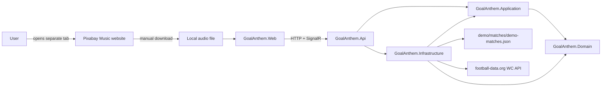

# GoalAnthem

Your team scores. Your anthem plays.

GoalAnthem is a football-viewing companion app. The intended flow is intentionally small: find a match, choose the team you support, choose an anthem, set the cue point, press match start at kickoff, and let the anthem play when that team scores.

## Current Project Status

Repository foundation and the sixth vertical slice are implemented. The app can load selectable matches, use optional World Cup fixture data from football-data.org when configured, fall back to deterministic demo matches without an API key, let the user choose a match and team, import a local audio file, set a cue point, start a backend-owned deterministic match session, receive match updates over SignalR, and play the imported local audio when the supported team scores.

For royalty-free music discovery, the app links to the official Pixabay Music site. The user downloads music directly from Pixabay, returns to GoalAnthem, and imports the downloaded file as normal local browser audio.

Screenshot placeholder: not yet available.

## Quick Start

Prerequisites:

- .NET 10 SDK
- Node.js 22 and npm
- Docker, optional

```bash
dotnet restore GoalAnthem.sln
npm ci --prefix src/GoalAnthem.Web
dotnet run --project src/GoalAnthem.Api
npm run dev --prefix src/GoalAnthem.Web
```

Open `http://127.0.0.1:5173`. The Vite dev server proxies `/api` and `/hubs` to `http://localhost:5000`.

Optional World Cup match data:

```bash
dotnet user-secrets set \
  "FootballData:ApiToken" \
  "YOUR_FOOTBALL_DATA_API_TOKEN" \
  --project src/GoalAnthem.Api

dotnet user-secrets list --project src/GoalAnthem.Api
```

The API project has a committed non-secret `UserSecretsId`; the actual token is stored outside the repository. Restart the API after changing the token. Leave it unset for deterministic demo data. The free provider plan may return delayed schedule or score updates, so the UI does not present it as real-time goal detection. Never commit a real token.

Optional royalty-free music workflow:

1. Open Pixabay Music from the anthem-selection screen.
2. Review the track and current license information on Pixabay.
3. Download directly from Pixabay.
4. Import the downloaded audio file in GoalAnthem.
5. Optionally save source metadata such as title, creator, source URL, download date, and Content ID notes.

GoalAnthem does not use a Pixabay API, connect a Pixabay account, download tracks, scrape pages, or verify licenses. Imported files and source metadata remain in the browser and are not uploaded, sent to the backend, or committed. Keep source/download records when possible. Some tracks may be registered with Content ID.

Docker Compose:

```bash
docker compose up --build
```

## Architecture Summary

GoalAnthem is a modular monolith with a React frontend.



- Domain contains match invariants and explicit types.
- Application owns the provider-neutral `Get matches` use case contract and mapping.
- Infrastructure reads deterministic JSON demo match data, optionally calls football-data.org when `FootballData__ApiToken` is configured, and owns in-memory backend match sessions through one centralized hosted worker.
- API is the composition root and exposes `/api/matches`, `/api/demo-matches` as a compatibility route, `/api/match-sessions`, `/hubs/matches`, `/health`, `/health/matches-provider`, and development Swagger UI.
- Web consumes public HTTP and SignalR contracts only.
- Local audio files, source metadata, and browser object URLs stay in the browser.
- Pixabay is an external discovery website, not an API dependency.

## Main User Flow

Implemented now:

1. Find a match from World Cup API data when configured, otherwise demo data.
2. Choose team.
3. Import a local audio file.
4. Set cue point.
5. Press start when kickoff is visible on the TV or stream.
6. Receive authoritative match-session updates from the backend.
7. Play the imported local anthem audio when the supported team scores.
8. Optionally record local source metadata for files downloaded separately from sites such as Pixabay.
9. Manually trigger or stop local anthem playback.

Planned:

1. Persistent multi-device sessions.
2. Optional live goal-event provider integration.
3. Production deployment hardening.

## Technology Choices

- .NET 10 and ASP.NET Core for the backend.
- React, TypeScript, and Vite for the frontend.
- xUnit for backend tests.
- Vitest and Testing Library for frontend behavior tests.
- GitHub Actions for pull-request validation.
- Version-controlled demo data so the repository works without API keys.
- Optional backend-only football-data.org integration for World Cup match selection.
- SignalR for backend-owned deterministic match sessions.
- Browser-local audio import with optional source metadata.
- Country flags are derived locally from provider-neutral ISO alpha-2 country codes; no external flag service is used.

## Testing Commands

```bash
dotnet format GoalAnthem.sln --verify-no-changes
dotnet test GoalAnthem.sln
npm run lint --prefix src/GoalAnthem.Web
npm run typecheck --prefix src/GoalAnthem.Web
npm run test --prefix src/GoalAnthem.Web
npm run build --prefix src/GoalAnthem.Web
```

## Roadmap

- Persistent match sessions beyond the current in-memory single-process implementation.
- Optional live goal-event provider integration.
- Playwright end-to-end smoke coverage.

## Explicit Limitations

- There is no music API integration, streaming-service control, or account flow.
- GoalAnthem links to Pixabay Music for manual discovery only; it does not download, scrape, embed, or verify Pixabay tracks.
- Automatic anthem playback requires a user-imported local audio file.
- Detailed live goal-event detection is not implemented.
- Backend match sessions are in-memory and are lost when the API process restarts.
- football-data.org free-plan data may be delayed and is used for match selection, not precise goal triggering.
- Authentication is not implemented.
- No real club names, logos, copyrighted assets, or local audio files are included.
- Local audio files never leave the browser.
