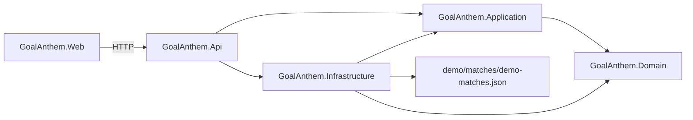

# GoalAnthem

Your team scores. Your anthem plays.

GoalAnthem is a football-viewing companion app. The intended flow is intentionally small: find a match, choose the team you support, choose an anthem, set the cue point, press match start at kickoff, and let the anthem play when that team scores.

## Current Project Status

Repository foundation and the fourth thin vertical slice are implemented. The app can load deterministic demo matches, let the user choose a match and team, pick a deterministic demo anthem or a local audio file, set a cue point, start a deterministic match mode, and play the selected anthem when the supported team scores.

Screenshot placeholder: not yet available.

## Quick Start

Prerequisites:

- .NET 10 SDK
- Node.js 22 and npm
- Docker, optional

```bash
dotnet restore GoalAnthem.sln
npm ci --prefix src/GoalAnthem.Web
dotnet run --project src/GoalAnthem.Api
npm run dev --prefix src/GoalAnthem.Web
```

Open `http://localhost:5173`. The Vite dev server proxies `/api` to `http://localhost:5000`.

Docker Compose:

```bash
docker compose up --build
```

## Architecture Summary

GoalAnthem is a modular monolith with a React frontend.



- Domain contains match invariants and explicit types.
- Application owns the `Get demo matches` use case contract and mapping.
- Infrastructure reads deterministic JSON demo match data and validates it at the boundary.
- API is the composition root and exposes `/api/demo-matches`, `/health`, and development Swagger UI.
- Web consumes public HTTP contracts only.

## Main User Flow

Implemented now:

1. Find match.
2. Choose team.
3. Choose anthem.
4. Set cue point.
5. Start match.
6. Play anthem when the supported team scores.
7. Manually trigger or stop anthem playback.

Planned:

1. Deterministic second-half scenario refinements.
2. Optional Spotify Premium integration.
3. Optional live football data provider integration.

## Technology Choices

- .NET 10 and ASP.NET Core for the backend.
- React, TypeScript, and Vite for the frontend.
- xUnit for backend tests.
- Vitest and Testing Library for frontend behavior tests.
- GitHub Actions for pull-request validation.
- Version-controlled demo data so the repository works without API keys.

## Testing Commands

```bash
dotnet format GoalAnthem.sln --verify-no-changes
dotnet test GoalAnthem.sln
npm run lint --prefix src/GoalAnthem.Web
npm run typecheck --prefix src/GoalAnthem.Web
npm run test --prefix src/GoalAnthem.Web
npm run build --prefix src/GoalAnthem.Web
```

## Roadmap

- Deterministic scenario refinements.
- Optional Spotify Premium integration.
- Optional live football data provider integration.

## Explicit Limitations

- Spotify is not implemented.
- Live football data is not implemented.
- Authentication is not implemented.
- No real club names, logos, copyrighted assets, or local audio files are included.
