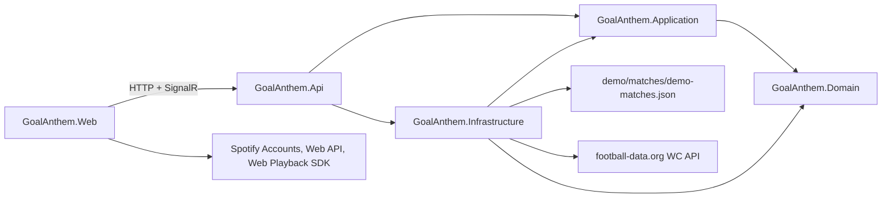

# GoalAnthem

Your team scores. Your anthem plays.

GoalAnthem is a football-viewing companion app. The intended flow is intentionally small: find a match, choose the team you support, choose an anthem, set the cue point, press match start at kickoff, and let the anthem play when that team scores.

## Current Project Status

Repository foundation and the sixth vertical slice are implemented. The app can load selectable matches, use optional World Cup fixture data from football-data.org when configured, fall back to deterministic demo matches without an API key, let the user choose a match and team, pick a deterministic demo anthem or a local audio file, set a cue point, start a backend-owned deterministic match session, receive match updates over SignalR, and play eligible local/demo audio when the supported team scores.

Spotify can optionally be configured as a browser-only companion integration for account connection, track search, metadata, and setup-time manual playback. Spotify tracks are never used for automatic goal playback.

Screenshot placeholder: not yet available.

## Quick Start

Prerequisites:

- .NET 10 SDK
- Node.js 22 and npm
- Docker, optional

```bash
dotnet restore GoalAnthem.sln
npm ci --prefix src/GoalAnthem.Web
dotnet run --project src/GoalAnthem.Api
npm run dev --prefix src/GoalAnthem.Web
```

Open `http://127.0.0.1:5173`. The Vite dev server proxies `/api` and `/hubs` to `http://localhost:5000`.

Optional World Cup match data:

```bash
dotnet user-secrets set \
  "FootballData:ApiToken" \
  "YOUR_FOOTBALL_DATA_API_TOKEN" \
  --project src/GoalAnthem.Api

dotnet user-secrets list --project src/GoalAnthem.Api
```

The API project has a committed non-secret `UserSecretsId`; the actual token is stored outside the repository. Restart the API after changing the token. Leave it unset for deterministic demo data. The free provider plan may return delayed schedule or score updates, so the UI does not present it as real-time goal detection. Never commit a real token.

Optional Spotify companion setup:

1. Create or open an app in the Spotify Developer Dashboard.
2. Add this exact Redirect URI to the app settings:

```text
http://127.0.0.1:5173
```

Spotify requires an explicit loopback IP for local HTTP development; `localhost` is not accepted. The redirect URI must match exactly.

3. Create the ignored frontend environment file:

```bash
cat > src/GoalAnthem.Web/.env.local <<'EOF'
VITE_SPOTIFY_CLIENT_ID=YOUR_PUBLIC_SPOTIFY_CLIENT_ID
VITE_SPOTIFY_REDIRECT_URI=http://127.0.0.1:5173
EOF
```

4. Restart the Vite development server and open the same loopback URL:

```bash
npm run dev --prefix src/GoalAnthem.Web
```

Open `http://127.0.0.1:5173`, not `http://localhost:5173`.

Use only the public Spotify Client ID. Do not use or commit a client secret. Spotify Web Playback SDK usage requires an eligible Spotify Premium account, and Spotify Development Mode restricts access to authorized users. The app remains fully usable with demo/local audio when Spotify is not configured.

Docker Compose:

```bash
docker compose up --build
```

## Architecture Summary

GoalAnthem is a modular monolith with a React frontend.



- Domain contains match invariants and explicit types.
- Application owns the provider-neutral `Get matches` use case contract and mapping.
- Infrastructure reads deterministic JSON demo match data, optionally calls football-data.org when `FootballData__ApiToken` is configured, and owns in-memory backend match sessions through one centralized hosted worker.
- API is the composition root and exposes `/api/matches`, `/api/demo-matches` as a compatibility route, `/api/match-sessions`, `/hubs/matches`, `/health`, `/health/matches-provider`, and development Swagger UI.
- Web consumes public HTTP and SignalR contracts only.
- Spotify OAuth tokens, authorization codes, PKCE verifiers, local audio files, and browser object URLs stay in the browser.

## Main User Flow

Implemented now:

1. Find a match from World Cup API data when configured, otherwise demo data.
2. Choose team.
3. Choose anthem.
4. Set cue point.
5. Start match.
6. Receive authoritative match-session updates from the backend.
7. Play local/demo anthem audio when the supported team scores.
8. Optionally connect Spotify for companion track search and setup-time manual playback.
9. Manually trigger or stop eligible local/demo anthem playback.

Planned:

1. Persistent multi-device sessions.
2. Optional live goal-event provider integration.
3. Production deployment hardening.

## Technology Choices

- .NET 10 and ASP.NET Core for the backend.
- React, TypeScript, and Vite for the frontend.
- xUnit for backend tests.
- Vitest and Testing Library for frontend behavior tests.
- GitHub Actions for pull-request validation.
- Version-controlled demo data so the repository works without API keys.
- Optional backend-only football-data.org integration for World Cup match selection.
- SignalR for backend-owned deterministic match sessions.
- Optional browser-only Spotify PKCE, Web API search, and setup-time Web Playback SDK controls.

## Testing Commands

```bash
dotnet format GoalAnthem.sln --verify-no-changes
dotnet test GoalAnthem.sln
npm run lint --prefix src/GoalAnthem.Web
npm run typecheck --prefix src/GoalAnthem.Web
npm run test --prefix src/GoalAnthem.Web
npm run build --prefix src/GoalAnthem.Web
```

## Roadmap

- Persistent match sessions beyond the current in-memory single-process implementation.
- Optional live goal-event provider integration.
- Playwright end-to-end smoke coverage.

## Explicit Limitations

- Spotify is implemented only as an optional companion/reference integration and setup-time manual player.
- Spotify must not be controlled by goal events, SignalR messages, match clocks, score changes, kickoff synchronization, or manual goal controls.
- Detailed live goal-event detection is not implemented.
- Backend match sessions are in-memory and are lost when the API process restarts.
- football-data.org free-plan data may be delayed and is used for match selection, not precise goal triggering.
- Authentication is not implemented.
- No real club names, logos, copyrighted assets, or local audio files are included.
- Local audio files never leave the browser.
- Spotify tokens never reach the backend.
