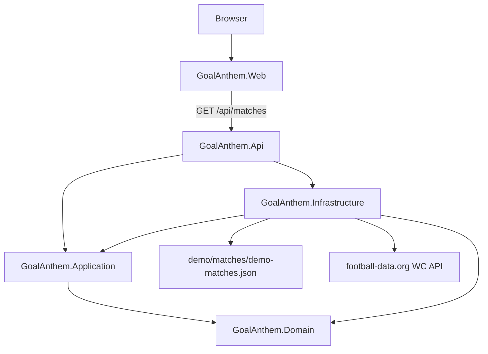

# Architecture

GoalAnthem uses a modular monolith backend and a separate React frontend.

## Backend Projects

- `GoalAnthem.Domain`: domain types and invariants. It has no project references.
- `GoalAnthem.Application`: vertical-slice handlers and application DTOs. It may reference Domain.
- `GoalAnthem.Infrastructure`: file-backed deterministic providers and future external-provider adapters. It may reference Application and Domain.
- `GoalAnthem.Api`: composition root, HTTP endpoints, CORS, health checks, Problem Details, and development API docs.

## Frontend Project

`GoalAnthem.Web` is a Vite React app. It communicates through HTTP contracts and does not reference backend internals.

## Current Vertical Slices

`Get matches`:

1. `demo/matches/demo-matches.json` stores stable demo match scenarios.
2. Infrastructure parses and validates JSON into domain objects for the zero-configuration fallback.
3. When `FootballData__ApiToken` is configured, Infrastructure calls football-data.org v4 for competition code `WC` through `IHttpClientFactory`.
4. Provider DTOs are mapped at the Infrastructure boundary into domain match objects.
5. The provider uses a short in-memory cache, protects concurrent cache misses, handles upstream rate limits, and falls back to cached or demo data safely.
6. Application maps domain objects and provider metadata into HTTP-safe DTOs.
7. API exposes `GET /api/matches` and a legacy `GET /api/demo-matches` compatibility route.
8. Web renders loading, empty, error, source, freshness, fallback, and manual-refresh states for the match list.

`Match setup`:

1. Web lets the user select a match and then a supported team.
2. Web lets the user choose a deterministic demo anthem or a local audio file.
3. Web lets the user set and validate a cue point, preview audio, and reach a Ready summary.

`Match mode`:

1. Web treats `Start match` as the local TV kickoff synchronization point.
2. A frontend match simulation engine processes deterministic event scenarios through a small scheduler boundary.
3. Stable event IDs prevent duplicate goal processing.
4. Supported-team goals trigger browser-local anthem playback from the configured cue point.
5. Manual playback, stop playback, and end-match controls remain local to the browser session.

## Error Handling

The API registers ASP.NET Core Problem Details and uses standard HTTP status codes. Provider failures do not expose tokens or provider internals; match selection falls back to cached live data or deterministic demo data where possible.

## Provider Health

`/health` reports application health. `/health/matches-provider` reports whether the optional live match provider is configured and whether the last upstream fetch failed, without exposing the API token.

## Local Integration

CORS is limited to `http://localhost:5173` and `http://127.0.0.1:5173` for local Vite development.
