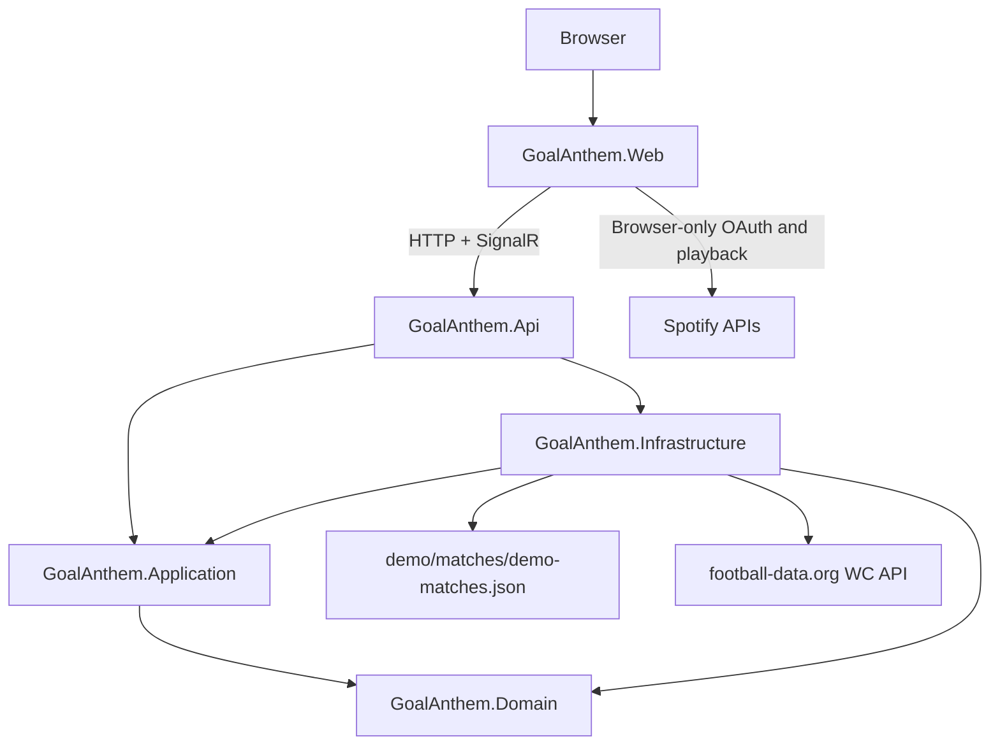

# Architecture

GoalAnthem uses a modular monolith backend and a separate React frontend.

## Backend Projects

- `GoalAnthem.Domain`: domain types and invariants. It has no project references.
- `GoalAnthem.Application`: vertical-slice handlers and application DTOs. It may reference Domain.
- `GoalAnthem.Infrastructure`: file-backed deterministic providers and future external-provider adapters. It may reference Application and Domain.
- `GoalAnthem.Api`: composition root, HTTP endpoints, CORS, health checks, Problem Details, and development API docs.

## Frontend Project

`GoalAnthem.Web` is a Vite React app. It communicates through public HTTP and SignalR contracts and does not reference backend internals.

## Current Vertical Slices

`Get matches`:

1. `demo/matches/demo-matches.json` stores stable demo match scenarios.
2. Infrastructure parses and validates JSON into domain objects for the zero-configuration fallback.
3. When `FootballData__ApiToken` is configured, Infrastructure calls football-data.org v4 for competition code `WC` through `IHttpClientFactory`.
4. Provider DTOs are mapped at the Infrastructure boundary into domain match objects.
5. The provider uses a short in-memory cache, protects concurrent cache misses, handles upstream rate limits, and falls back to cached or demo data safely.
6. Application maps domain objects and provider metadata into HTTP-safe DTOs.
7. API exposes `GET /api/matches` and a legacy `GET /api/demo-matches` compatibility route.
8. Web renders loading, empty, error, source, freshness, fallback, and manual-refresh states for the match list.

`Match setup`:

1. Web lets the user select a match and then a supported team.
2. Web lets the user choose a deterministic demo anthem or a local audio file.
3. Web lets the user set and validate a cue point, preview audio, and reach a Ready summary.

`Match mode`:

1. Web treats `Start match` as the local TV kickoff synchronization point.
2. API creates an in-memory match session through `POST /api/match-sessions`.
3. Infrastructure owns session state, selected match metadata, supported team, speed, elapsed match seconds, scores, status, processed event IDs, timeline, full-time transition, explicit end, and expired-session cleanup.
4. One centralized hosted worker advances every active match session with `TimeProvider`; the implementation does not create one timer or background task per session.
5. Demo speed advances 15 match seconds per real second. Normal speed advances one match second per real second.
6. Delayed worker ticks process every crossed deterministic event exactly once and in chronological order.
7. API streams session snapshots, processed events, and ended notifications through the typed SignalR hub at `/hubs/matches`.
8. Web receives authoritative snapshots and events, deduplicates handled event IDs per active session, and only triggers eligible browser-local demo/local audio for newly observed supported-team goals.
9. Web exposes explicit local demo fallback. Remote and local simulation modes never run at the same time.
10. Manual playback, stop playback, and browser audio cleanup remain local to the browser session.

`Spotify companion`:

1. Spotify is a browser-only optional integration configured with `VITE_SPOTIFY_CLIENT_ID` and `VITE_SPOTIFY_REDIRECT_URI`.
2. Authorization uses Authorization Code with PKCE. The browser generates the verifier, challenge, and state; no client secret is used.
3. Tokens are stored only in session-scoped browser storage and are never sent to the backend.
4. Search calls Spotify Web API directly from the browser after connection, maps responses to small internal track metadata, limits results to 10, and handles 401, 403, and 429 states explicitly.
5. Web Playback SDK loads only after explicit user action and is used only for setup-time manual controls.
6. Spotify track metadata can appear in the Ready summary and match mode as a companion selection with an external Spotify link.
7. Spotify playback is intentionally not wired to goal events, SignalR, match clocks, scores, kickoff synchronization, local simulation events, or manual goal controls.

## Error Handling

The API registers ASP.NET Core Problem Details and uses standard HTTP status codes. Provider failures do not expose tokens or provider internals; match selection falls back to cached live data or deterministic demo data where possible.

Match-session endpoints use Problem Details for invalid input, unknown sessions, unsupported speed, invalid teams, conflicts, and illegal transitions.

## Provider Health

`/health` reports application health. `/health/matches-provider` reports whether the optional live match provider is configured and whether the last upstream fetch failed, without exposing the API token.

## Local Integration

CORS is limited to `http://localhost:5173` and `http://127.0.0.1:5173` for local Vite development.

## Current Limitations

- Match sessions are in-memory and single-process; API restarts end active sessions.
- SignalR reconnect can rehydrate the latest authoritative snapshot, but there is no persistent event store.
- Spotify Development Mode and Premium eligibility are enforced by Spotify, not by this repository.
- Official Spotify references used for this design: [Authorization Code with PKCE](https://developer.spotify.com/documentation/web-api/tutorials/code-pkce-flow), [Web API search](https://developer.spotify.com/documentation/web-api/reference/search), [Web Playback SDK](https://developer.spotify.com/documentation/web-playback-sdk), [rate limits](https://developer.spotify.com/documentation/web-api/concepts/rate-limits), and [Spotify Developer Policy](https://developer.spotify.com/policy).
