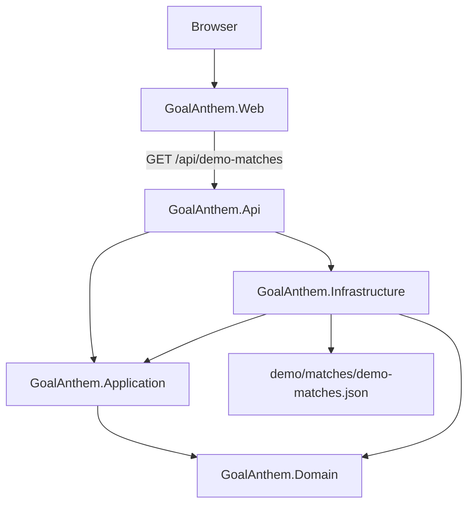

# Architecture

GoalAnthem uses a modular monolith backend and a separate React frontend.

## Backend Projects

- `GoalAnthem.Domain`: domain types and invariants. It has no project references.
- `GoalAnthem.Application`: vertical-slice handlers and application DTOs. It may reference Domain.
- `GoalAnthem.Infrastructure`: file-backed deterministic providers and future external-provider adapters. It may reference Application and Domain.
- `GoalAnthem.Api`: composition root, HTTP endpoints, CORS, health checks, Problem Details, and development API docs.

## Frontend Project

`GoalAnthem.Web` is a Vite React app. It communicates through HTTP contracts and does not reference backend internals.

## Current Vertical Slice

`Get demo matches`:

1. `demo/matches/demo-matches.json` stores stable demo match scenarios.
2. Infrastructure parses and validates JSON into domain objects.
3. Application maps domain objects into HTTP-safe DTOs.
4. API exposes `GET /api/demo-matches`.
5. Web renders loading, empty, error, and selectable loaded states.

## Error Handling

The API registers ASP.NET Core Problem Details and uses standard HTTP status codes. The current endpoint has no user input and therefore no request validation errors.

## Local Integration

CORS is limited to `http://localhost:5173` and `http://127.0.0.1:5173` for local Vite development.
